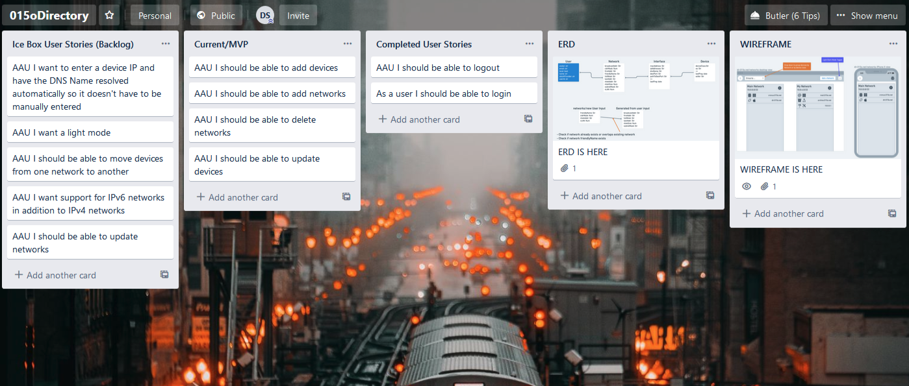
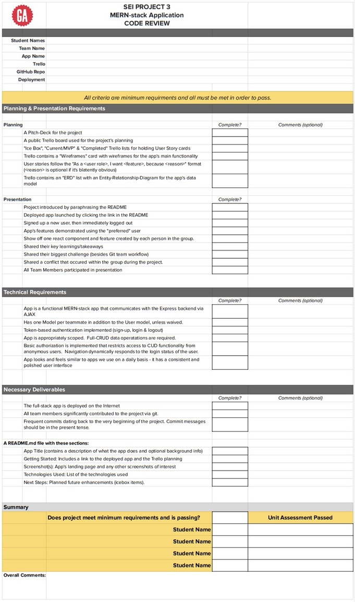
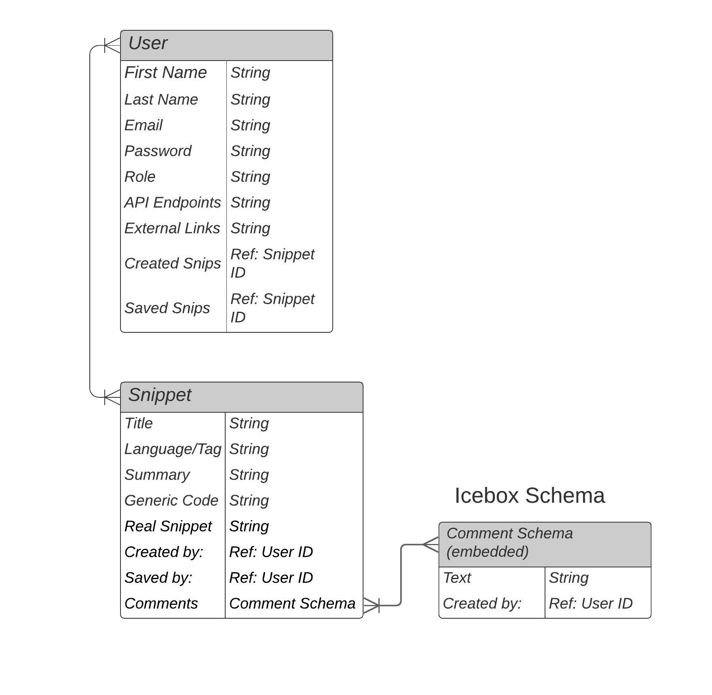
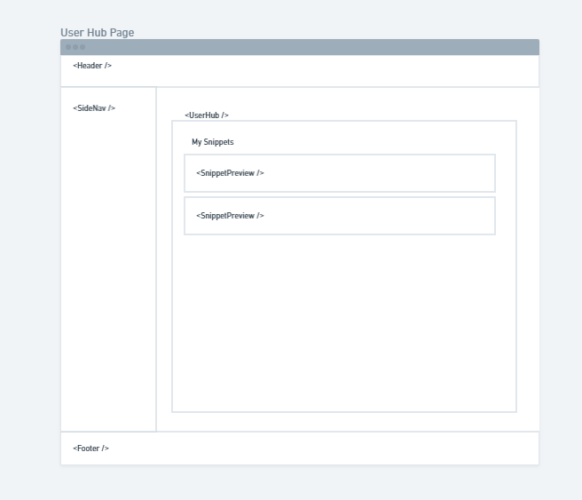
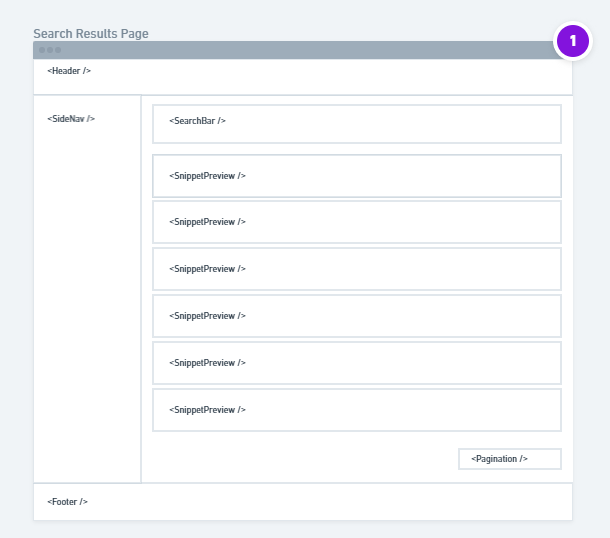
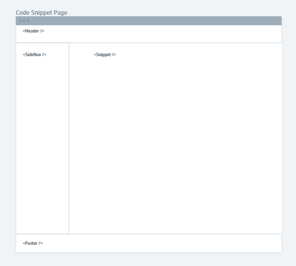
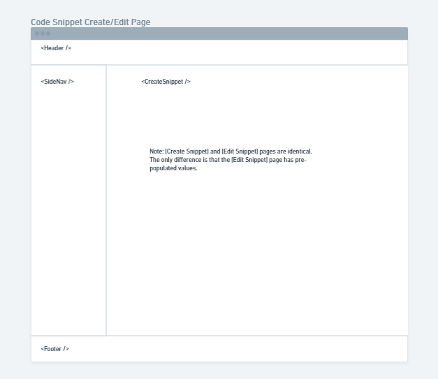
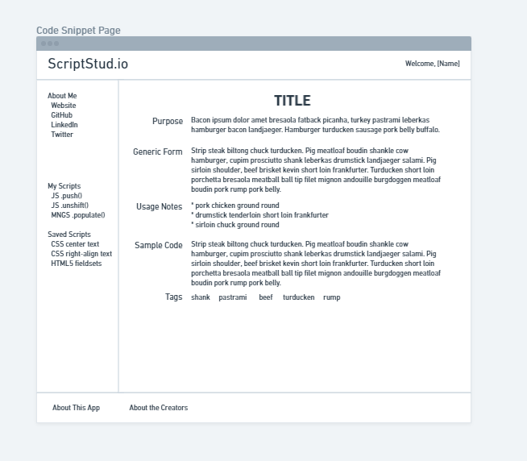
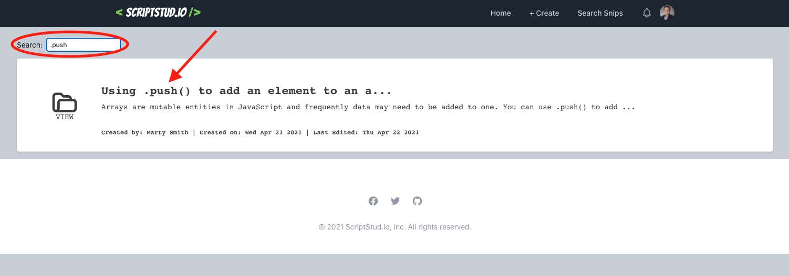
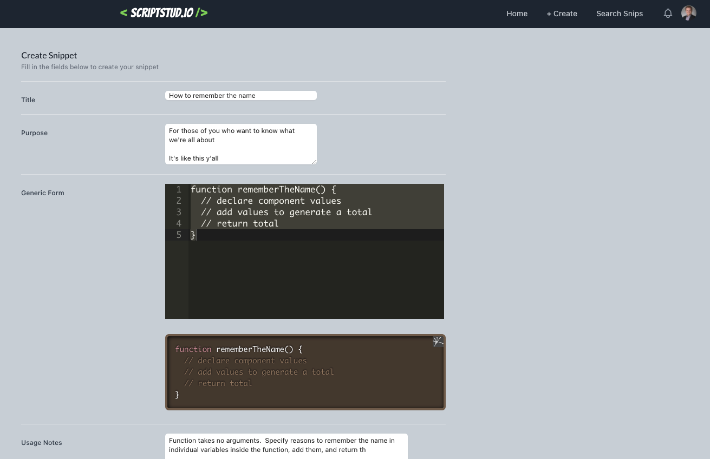

# Introduction

Software engineers, developers, and other professionals in the IT community often consult the internet for resources to help them write good code and troubleshoot code when it doesn't work.  Such resources exist predominantly in one of two models.

1. Official documentation from the maintainers of a language, technology, or framework.
2. Forums where developers share problematic code to crowdsource the process of troubleshooting.

The problem is that not all technologies are developed with thorough documentation.  When official documentation is lacking, engineers often need to consult 3rd party websites, blogs, and other user-created resources.  Although many platforms are easy-to-use and highly accessible to the casual user, many of these are built around the idea of asking questions about bad code rather than presenting good code.  While good code is usually generated in responses to users, it is frequently written to fit the particular context of the question asked and is not presented in a generic format and may need significant refactoring to be reused in other codebases.

To fill this gap, we have created ScriptStud.io.  ScriptStud.io is a platform which is easy for a casual user to interface with and allows users to upload examples of well-written code with contextual information about use.  It will also be presented in an accessible manner which is easy for a user to read with minimal distraction or superfluous on-page content.  This will allow engineers to save, share, and find code for their projects efficiently.

The developers of this app originally created it as a Unit Project for their curriculum as Fellows in General Assembly's Software Engineering Immersion program.  See [Appendix A](#appendix-a-assignment) for more information on the original specifications.

To optimize readability of code in this file, it is suggested to view it with text-wrapping set to no fewer than 160 characters.

# Table of Contents
1. [Instructions for Use](#instructions)
2. [Version Notes](#version-notes)
3. [Tech Framework](#tech-framework)
4. [Future Plans](#future-plans)
5. [Contribute](#contribute)
6. [Special Thanks](#special-thanks)
7. [Appendices](#appendices)
   1. [Appendix A: Unit 1 Project Assignment from General Assembly](#appendix-a-assignment)
   2. [Appendix B: Project Pre-Planning](#appendix-b-planning)
   3. [Appendix B: Product Screenshots & Images](#appendix-c-pictures)

[Back to Top](#top)

# Instructions for Use

The user first arrives at a [splash page](#appendix-c-picture-001-splash-page-not-logged-in) when navigating to the root directory of the URL and is prompted to log in or sign up for an account.  Once signed-in, the user is redirected to a [search results page](#appendix-c-picture-002-search-results-page-logged-in) that shows a central list of all uploaded snippets.  This page also features a search bar up top; as the user types a string into the search field, the page will [dynamically update the displayed snippets](#appendix-c-picture-003-dynamic-search-rendering-logged-in) to show ones which contain the search string somewhere in their content.

The nav bar in the header has a link to create a new snippet; when clicked the user is taken to a page with a [create snippet form](#appendix-c-picture-004-create-snippet-page-logged-in).  The user types information about their snippet.  Two code blocks are provided where the user can type code and see a dynamically-rendered preview with syntax highlighting.

[Back to Top](#top)

# Version Notes

The **1.0.0** version of this app is currently uploaded.  In cases where I update the README without any updates to the website itself I do not update the version number or use branches for my work.  Each version number will lack a commit number until the next version is uploaded.  The current commit number is always added retroactively.  In general, for version number format X.Y.Z:

* X: increases in this number represent a complete overhaul of some section of the website, source code, or UI
* Y: increases in this number represent a major functional change/aesthetic change or addition to the app
* Z: increases in this number represent changes that are relatively minor but still warrant a new commit

Version XXXXXXX is the first version with the full range of intended functions successfully implemented.  Version 1.0.0 is the first to be both full functional and styled with optimized coding.

#### Please note that this is raw commit data!  It will be better organized in a future version of the file.

commit eec40b267ec9441b0533b08af2d272c44cb8c13e
Merge: 8c08b02 1f2b4f9
Author: Christian Mosley <cmosley@beholdmedia.com>
Date:   Tue Apr 13 20:49:34 2021 -0500

    Merge pull request #2 from ScriptStud-io/test-branch
    
    Test branch

commit 1f2b4f9b989fe71f6a0f49efc4865e594e287b91
Merge: 70bc1a4 5dfc87a
Author: Christian Mosley <cmosley@beholdmedia.com>
Date:   Tue Apr 13 16:25:08 2021 -0500

    Merge pull request #1 from Cmosley/christian-testing
    
    readme update

commit 5dfc87ab3e359fc06b38cc754b2c47779c991c02
Author: cmosley <cmosley@beholdmedia.com>
Date:   Tue Apr 13 15:49:22 2021 -0500

    readme update

commit 70bc1a44dcddfb4dcb9e11b04ca88c4437779105
Author: mhsmith321 <marty.smith01@yahoo.com>
Date:   Tue Apr 13 15:12:57 2021 -0400

    create test-branch

commit 8c08b02c551cb929afcc120f3e4fa513f7eea30f
Author: mhsmith321 <marty.smith01@yahoo.com>
Date:   Tue Apr 13 14:30:41 2021 -0400

    create folder-file tree

commit 8c6dd58b9557ddb7e4e547cb0a5bd18520c4a014
Author: mhsmith321 <marty.smith01@yahoo.com>
Date:   Tue Apr 13 13:57:19 2021 -0400

    delete unnecessary files from boilerplate

commit c918ead883b9d88e2f0e29b6a66c8b7a0c90ef88
Author: mhsmith321 <marty.smith01@yahoo.com>
Date:   Tue Apr 13 13:45:41 2021 -0400

    initial commit

# Tech Framework

### This app uses:
* HTML5 and CSS
* JavaScript ES6
* [Node.js](https://nodejs.org/en/) v 15.9.0 & [Express](https://expressjs.com/) v 4.17.1
* [Tailwind CSS](https://tailwindcss.com/) v 2.1.1
* [dot env](https://www.npmjs.com/package/dotenv)
* [React Router](https://www.npmjs.com/package/react-router)
* [React Ace](https://www.npmjs.com/package/react-ace)
* [React Syntax Highlighter](https://www.npmjs.com/package/react-syntax-highlighter)
* [CORS](https://www.npmjs.com/package/cors)
* [PostCSS](https://www.npmjs.com/package/postcss) & [Autoprefixer](https://www.npmjs.com/package/autoprefixer)
* [JSON Web Token](https://www.npmjs.com/package/jsonwebtoken) v 8.5.1

### We built this app with:
* [VSCode](https://code.visualstudio.com/) version 1.55.2
* [MongoDB Atlas](https://www.mongodb.com/cloud/atlas)
* [Google Chrome](https://www.google.com/chrome/) version 90.0.4430.85 (Official Build) (arm64)
* [Homebrew](https://brew.sh/) version 3.0.11
* Zsh version with [Oh My Zsh](https://ohmyz.sh/)
* [GitHub](https://github.com/) (online, not desktop)

### This app is hosted at:
* [GitHub Repo](https://github.com/ScriptStud-io/ScriptStud.io)
* [Heroku Hosted Site](https://script-studio.herokuapp.com/)

[Back to Top](#top)

# Future Plans
* Host the site at the URL http://scriptstud.io/ which we have acquired.
  * Configure Google Analytics.
* Add a password recovery feature.
* Create a custom favicon.
* Improve CSS to make the site more eye-friendly.
* Adjust CSS on `Create` and `Edit` pages to utilize full browser width.
* Make forms on `Create` and `Edit` pages better preserve whitespace (tabs and line breaks) when submitted to database.
* Add mobile-responsive CSS.
* Develop integrations with external applications:
  * Send code snippets to and receive from VS Code.
  * Send code snippets to and receive from GitHub/Gist.
  * Send code snippets to and receive from Stack Overflow.
* Refactor file structure and code organization.
  * Change all React class components to hooks.
  * Move API calls, state, and other functions higher in the filetree for DRYer code.
  * Format code for a consistent overall appearance.
  * Reorganize front end pathways for more intuitive structure.
  * Change `href` anchors to React Router `<Link />` components.
* Add support for OAuth
  * Google, GitHub
  * Sync data models for OAuth information with the current `User` model.  Must have two-way referencing.
* Create additional pages and views.
  * Create a tutorial page with videos.
  * A User Hub page that shows the logged-in users snippets, saved snippets, account settings, etc. Edit: I've now created a model for this data but we still need to CRUD the data.
* Allow users to upload avatar images.
  * Fix the fact that every user currently sees Christian's picture in the header.
* Add forced auto-correct for tags (eg, `JS` will always resolve as `JavaScript`).
* Add administrative user roles and permissions.
* Create a new data model for tags listing relevant snippets with two-way referencing.
* Create a new user data model for user info other than account metadata (eg: saved snippets).
* Create dark/light modes.
* Add pagination support on search result pages.

[Back to Top](#top)

# Contribute

At this point in time the developers are not looking for outside collaborators on ScriptStud.io.  That may change in the future as this project grows and scale issues require more skillsets and man-hours to build and maintain the platform.  If you believe in the mission of this product the best thing you can do is utilize the product, contribute code snippets, and help build our knowledgebase.

[Back to Top](#top)

# Special Thanks

* Instructors (Ben Manley, David Stinson, Shahzad Khan, and Sam Gemberling) and peers from the General Assembly SEIR-EC-2-22 cohort for collaboration in developing this app.
* The color palatte was generated with with [Coolors.co](https://coolors.co/) and [HTML Color Codes](https://htmlcolorcodes.com/) for template generation.  We used [Color Safe](http://colorsafe.co/) and [WebAIM](https://webaim.org/resources/contrastchecker/) to test our color choices for sufficient contrast to make the website accessible.
* Formatting this `README.md` file was easy with the help of the [Markdown Live Preview](https://markdownlivepreview.com/) tool and GitHub Guide's [Mastering Markdown](https://guides.github.com/features/mastering-markdown/) page.
* [Whimsical](https://whimsical.com/wireframes) was used to generate the wireframe images and ERDs seen throughout this `README.md` file.
* The code for this website was written with frequent reference to a number of 3rd party resources:
  * [CSS-Tricks](https://css-tricks.com/)
  * [Git-SCM](https://git-scm.com/docs)
  * [MDN Web Docs](https://developer.mozilla.org/en-US/)
  * [Mongoose Docs](https://mongoosejs.com/docs/guides.html)
  * [React Router Docs](https://reactrouter.com/core/guides/philosophy)
  * [Stack Overflow](https://stackoverflow.com/)

[Back to Top](#top)

# About the Developers

### Christian Mosley

Christian is a web developer from Fort Worth, TX. With a passion for business, sports and technology, Christian decided on a career change during COVID when he found the time to cultivate his passion for web development.  Learn more about Christian at these links:

* [LinkedIn](https://www.linkedin.com/in/christian-mosley)
* [GitHub](www.GitHub.com/cmosley)

### Marty Smith

Marty is a software engineer from Columbia, SC.  With past experience in bench science and digitail retailing, Marty is a full-stack developer with particular interests in back-end systems, accessible design, writing documentation, and pro-bono charity work.  Outside of his work, Marty enjoys cooking, camping, music, hockey, and spending time with his family.  Learn more about Marty at these Links:

* [LinkedIn](https://www.linkedin.com/in/the-marty-smith/)
* [GitHub](https://github.com/mhsmith321)
* [Website](https://martysmith.tech/)

# Appendices

[Back to Top](#top)

## Appendix A: Unit 3 Project Assignment from General Assembly

**Important!**  Information in this Appendix is republished with permission from proprietary materials from General Assembly.  These materials should not be reproduced or republished without re-obtaining permission from General Assembly.  This text has been formatted as to reproduce the original production as much as is possible with the limitations of vanilla markdown syntax.

### Unit 3 - A MERN stack CRUD Application

### Overview

**You’ve come a long way, and it’s time to show it.** This will be your most advanced project to date. **This project will push you both technically and collaboratively!**

You’ve already worked in small groups to accomplish various labs and exercises, but this time, we will challenge you to work in a small team on a project**.**

You and your teammates together will architect, design, and collaboratively build a full-stack web app.

You’ll be working as part of a team in the workplace, and **this project will provide you with that necessary team development experience.**

However, working on a project as part of a team can be more challenging due to logistical reasons, differing opinions, etc.

During this project, your instructors are going to be evaluating your ability to:

- Listen to and respect other opinions
- Share and contribute your ideas with the team
- Form a consensus and compromise when opinions differ

***Your ability to work in a team during this project is more important to your instructors than the project itself.***

**Before you start working** on the project’s planning, be sure to review your team's idea with an instructor to ensure that it both:

- **Meets the minimum requirements**, and
- **Is reasonably scoped**

### Deliverables and Dates

Working in a team will require more upfront planning to ensure the team is on the same page.

#### Pitch Deck Presentations - April 14

***Pitch your project** to the class ***in no more than 8 minutes***. All group members should participate in the pitch.

At a minimum your [**pitch deck**](https://pitchdeck.improvepresentation.com/what-is-a-pitch-deck) should include:

- The application and team name.
- Your team members, including their roles and responsibilities, use the list of potential team roles below to help guide you in this process.
- The problem you are going to solve with your app.
- Check out previous decks: [**SEI-CC-7**](https://drive.google.com/file/d/1g_NINf1ne3XEOpL5R3En3mQCLcjltJhg/view), [**SEI-CC-8**](https://drive.google.com/file/d/1Vu95x-SdWfQa0xqsxrYuGOUMJWhfCZO1/view), [**SEI-R-7-27**](https://youtu.be/A_lARpJQnD4), [**SEI-R-11-2**](https://www.youtube.com/watch?v=9Hs6MfMwKsw&list=PL2Kp3FX7ViJiFKVX7lJsk5QknZfID797Z&index=81)
- More info on potential team roles
    - **Scrum Manager**: the leader of the Agile processes (user stories, stand-ups, etc.) and manager of Trello.
    - **GitHub Manager (Git Commander)**: the primary person for managing the repo and GitHub team workflow (merging pull requests, etc.).
    - **Documenter**: the person in charge of the README, etc.
    - **Designer**: the person in charge of UI design/layout and styling.
    - **Database Manager**: this person will be in charge of creating and managing the models and their relationships.
    - **API Manager**: the person in charge of researching, registering with, etc. APIs.

#### Project Planning Materials - Due April 14 after Lunch

*Author's Note: Please see [Appendix B: Project Pre-Planning](#appendix-b-planning) for more information.*

As you’ve discovered, a project consists of more than just code. This project requires **planning** organized within a **Trello board**.

- A *public* [Trello](https://trello.com/) **board** with:

    - **User Stories**, each moving from left to right in the following three lists in your board: 
    - **Ice Box**
    - **Current/MVP**
    - **Completed**

    **User Stories** which should follow the following template: 
    ***As a <user role>, I want <feature>, because <reason>.*** 
    The reason is optional if it’s blatantly obvious.

    Prioritize your user stories within the Current/MVP card with your “wish list” stories in the Ice Box.

    * A **Wireframes** card containing wireframes for the app’s main pages of functionality; for example, a Landing Page, Posts Index Page, Favorite Posts Page, Add Post Page, etc.

    * An **ERD** card containing an ERD identifying the attributes of each Data Entity (one for each Model and embedded schema). The ERD also needs to diagram relationships between the Entities (1:1, 1:M, or M:M). Here’s a [**YouTube video to show you how**](https://www.youtube.com/watch?v=QpdhBUYk7Kk).

Additional cards as desired - for example, some teams like mapping out the planned features and the corresponding commit messages they will make as they work on the project.

***Make sure the Trello board you submit is publicly viewable!***

Here is an example of an acceptable initial Trello board:

#### GitHub Submission - Due April 16 by lunch

- A *public* GitHub repo with JWT Auth fully implemented in your app and an initial readme file.

***Make sure the GitHub repo you submit is publicly viewable***

Submit a link to your GitHub repo to the appropriate pinned thread in slack.

#### Deployment - Due April 20 by the end of class

- Your deployed application with all the work you have completed up to this point.

Submit a link to your deployed application to the appropriate pinned thread in slack.

#### Presentation - April 23

You will have 20 minutes to present and demonstrate the following:

1. Introduce your project by paraphrasing its README.
2. Click the link in the README to open the deployed app on Heroku.
3. Demonstrate the application’s authentication features by signing up a new user, logging out that user, then logging in with your preferred user.
4. Demonstrate your app’s main features.
5. Share/discuss the following code:
    - The “main” Mongoose model
    - Each team member should show off one react component and feature that they implemented.
6. Share the experience by answering the following:
    - What was your biggest challenge (besides git team workflow)?
    - What is a conflict that occurred within the group during the project?
    - What are your key learnings/takeaways?

Following your presentation, there may be a brief Q & A period and optional instructor feedback.

All group members must participate in the presentation. Remember, you will have 20 minutes for your presentation. While the amount of time you spend in each section is ultimately up to your group (as long as you cover all the above points) - it’s recommended to divide your time evenly among the six sections above so that your presentation has a good flow to it.

### Project Requirements

#### Version Control Requirements
☐ Your team must **manage team contributions and collaboration** using Git/GitHub team work-flow. Here are some references:

- [GitHub Group Workflow](https://www.notion.so/GitHub-Group-Workflow-e6126029ffbc4aae96461f215febcd66)
- [**Understanding the GitHub Flow**](https://guides.github.com/introduction/flow/)

☐ The project’s source code must be on each team member’s **GitHub**.

☐ The repo is to contain **frequent commits** dated from the beginning of the project through its completion. Do not start over by replacing the repository with a different one. All group members will have multiple commits - this helps back up your contributions should a conflict arise. If doing pair programming and collaboration, switch off between drivers so multiple team members get contributions.

#### README Requirements

Don’t underestimate the value of a well crafted README. The README introduces your project to prospective employers and forms their first impression of your work!

Do not include project planning (user stories, wireframes, or ERDs) in the README!

*Author's Note: I did anyway. :P*

Include the following sections within the **`README.md`**:

☐ **App Title:** Contains a description of what the app does and optional background info.

☐ **Getting Started**: That Includes:

- A link to the **deployed app** (Heroku or elsewhere on the internet)
- A link to the **Trello board** used for the project’s planning that includes user stories, wireframes & an ERD.

☐ **Screenshot(s):** A screenshot of your app’s landing page and any other screenshots of interest.

☐ **Technologies Used**: List of the technologies used.

☐ **Next Steps**: Planned future enhancements (icebox items).

#### Technical Requirements
☐ A **working** full-stack, single-page application deployed on the internet.

☐ Incorporate the technologies of the **MERN-stack**:

- MongoDB/Mongoose
- Express
- React
- Node

☐ **Have a well-styled interactive front-end**.

☐ Communicates with the **Express** backend via AJAX.

☐ Has one Model per teammate in addition to the User model, unless waived.

☐ Implement token-based **authentication**. Including the ability of a user to sign-up, log in & log out.

☐ Implement **authorization** by restricting CUD data functionality to authenticated users. Also, navigation should respond to the login status of the user.

☐ **Have a well-scoped feature-set**. Full-CRUD data operations are required. Feel free to include more features - here are some ideas:

- Consume data from a third-party API.
- Implement additional functionality if the user is an admin.
- Utilize real-time communications (beware that this is difficult and time-consuming - please seek instructor approval).
- Implementation of a highly dynamic UI.
- Other, instructor-approved, complexity/features.

### Notes and Guidance

#### Self-sufficiency / Project Assistance
- At this stage of SEI, finding the answers to development issues is of paramount importance.
- Use all resources available to solve the problem within your group before seeking assistance outside the team.
- If you seek help in the support channel, explain the issue as clearly and detailed as you can, include screenshots when possible, and be prepared to explain what your team has done to solve the issue.

#### Project Feedback + Evaluation
- Your instructors will be using the Unit 3 Code Review form to determine whether the project passes all of the minimum requirements.
- Your instructors will endeavor to deliver your code review ASAP the week following Friday’s presentation.
- If your instructors determine that your project would pass with minor fixes, you will be required to address the minor deficiencies by 9 am the following day. Please be sure to inform your local instructor when the fixes are complete. FYI, “minor fixes” are minor items that can be fixed very quickly, like code formatting, correcting the README, etc.
- If your instructors determine that the project does not meet the minimum requirements, you may request to address the deficiencies identified and resubmit the project. However, be aware that **there is only a single opportunity to resubmit a project or project assessment during the course**.
- Immediately after your presentation, your instructor may provide you with feedback that will benefit your project and perhaps the projects of other students.
- If there is a specific section of code that you would like an instructor to provide additional feedback, please ask!

#### Code Review Rubric

#### Suggestions to Get Started
- Don’t get too caught up in too many awesome features – simple is better. Favor fewer features that look/feel impressive over numerous clunky/sloppy features.
- Because it takes longer to code user interfaces using React than with EJS & DTL, prioritize user stories to meet the MVP and icebox the others.
- Implement the `User` model and authentication first. Then implement the “As a visitor, when I browse to the app, I want…” user story.
- Follow the steps we’ve done in class to implement features, beginning with the user’s interaction, identifying the proper route, etc.
- Read the docs for whatever technologies/frameworks/API’s you use.

#### Suggestions for Success
1. **Identify roles** on the team, which may be:
    - **Scrum Master**: the leader of the Agile processes (user stories, stand-ups, etc.) and manager of Trello.
    - **GitHub Manager**: the primary person for managing the repo and GitHub team workflow (merging pull requests, etc.).
    - **Documenter**: the person in charge of the README, etc.
    - **Designer**: the person in charge of UI design/layout and styling.
    - **Database manager**: this person will be in charge of creating and managing the models and their relationships.
    - **API Manager**: the person in charge of researching, registering with, etc. APIs.

    You *don’t have to fulfill any of the above roles formally!* They are only listed to provide ideas/guidance.

2. Because your app’s functionality & CRUD revolves around the logged-in user, **implement authentication and basic navigation first!**
3. **Remember to keep things small and focus on the MVP** – feature creep can doom a project!
4. Read the docs for whatever technologies / frameworks / API’s you use.
5. **Be consistent with your code style.** You have multiple developers in your team writing code, but you only have one app per team. Make sure it looks like a unified effort in regards to formatting, etc. For example, consistent vertical whitespace between functions. A properly configured code beautifier may help with this!
6. Do your best to have only one dev working on a certain file between commits. This will avoid merge conflicts. This is another reason to separate responsibilities between team members when possible.
7. **Commit early, commit often.**
8. **Pair programming** can be an excellent way for team members to share knowledge and contribute to the project.
9. Consider following a [**Mob Programming**](https://en.wikipedia.org/wiki/Mob_programming) approach where the team is always developing together on a single computer. Read [**this post**](http://underthehood.meltwater.com/blog/2016/06/01/mob-programming/) for more information.

#### Best Practices
- In a SPA, communication with the backend is via AJAX. Use **RESTful API routing to CRUD your data entities (resources)**. In addition to CRUD functionality, be sure to perform other functionality, e.g., logging in via AJAX. As a best practice, make those AJAX calls from “service” modules, not components.
- **Be consistent** with your code style.
- **Clearly name variables and functions** - remember, variables are usually named as **nouns** and functions as **verbs**.
- **Write well-formatted JS & CSS.** Properly formatting your code makes it more readable. Improperly formatted code infers sloppiness.
- **Comment your code where it makes sense to do so**. Most code is self-documenting (don’t comment the obvious); however, use comments to explain complicated code.

### Project Assessment
There will be a Project 3 Assessment.

Passing the project assessment is a requirement of the project itself.

The goal of Project 3’s assessment will be to gauge your ability to develop a minimal React application that:

- Renders user-defined components
- Updates state in response to some basic user interaction
- Dynamically styles components based upon state

The assessment will not require using a database or routing.

You will work on the assessment individually; however, the assessment is “open book”, so you will have access to all notes, code, lessons, google, etc.

We anticipate that it will take 45 - 90 minutes to complete. However, if necessary, you have up to 3 hours.

[Back to Top](#top)

## Appendix B: Project Pre-Planning

**Important!**  Some information in this section may appear to contradict information elsewhere in this `README.md` file.  It should be noted that this information represents how the project was conceived in the initial planning stage.  Contradictory elsewhere in this file likely represents current and more accurate information.

### User Expectations

#### As a user:

* I want to create, edit, and delete my own code snippets.
* I want to organize and sort my own code snippets according to tags.
* I want to designate my code snippets as either public or private.
* I want to search for code snippets created by other users by topic, technology, or functional purpose.
* I want to find code snippets uploaded by other users and save ones I like.

### User Stories

1. Michelle is a React developer who works as an independent contractor and frequently uses similar code fragments in unrelated projects for different clients. Rather than always writing code from scratch, she wishes that she could have a neat, organized repository to store code fragments and boilerplate layouts for later reference and use. She creates a user account in ScriptStud.io and whenever she finds herself typing a code fragment or stubbing a template she knows she has used before, she copies it to the database and indexes it for later use.

2. David is a full-stack engineer who usually works with MERN stack applications; although he focuses primarily on managing the front-end of his projects, he occasionally sets up code for MongoDB using Mongoose. He usually has to reteach himself Mongoose function syntax due to the the infrequency with which he uses the library and always has a challenge due to the poor quality of the official documentation. He also consults forums like Stack Overflow, but is frustrated that search results are usually of mixed relevance to his purpose or don't adequately show how the function syntax is constructed. He creates an account with ScriptStud.io to log examples of the Mongoose functions he uses most frequently with clear explanations of their syntax with example code snippets.

### Databases

**Model: Account**  |  (user profile information)
* `accountUser` reference to the `User` document of account owner
* `accountSavedSnippets` array of references to snippets the user has "saved" for quick reference
* `accountGitHubUrl` URL for the user's GitHub profile
* `accountGitHubHandle` user's GitHub username
* `accountStackOverflowUrl` URL for the user's Stack Overflow profile
* `accountStackOverflowHandle` user's Stack Overflow username
* `accountTwitterUrl` URL for the user's Twitter profile
* `accountTwitterHandle` user's Twitter username
* `accountLinkedInUrl` URL for the user's LinkedIn profile
* `accountPersonalWebsiteUrl` URL for the user's personal website

**Model: Snippet**  |  (snippet data)
* `title` title of snippet
* `purpose` purpose of snippet
* `generic` generic form/syntax of snippet
* `notes` usage notes and information
* `sample` example of snippet being used
* `tags` topic tags for snippet
* `addedBy` reference to `User` document of snippet creator
* `timestamps` (create/update)

**Model: User**  |  (user account metadata)
* `username` user's login handle (also display name)
* `email` user's email address
* `password` user's password (encrypted)
* `timestamps` (create/update)

**Entity Relationship Diagram (ERD)**

### Wireframes & Mockups

**Splash Page (React Component layout)**

**User Hub (React Component Layout)**

**Search Results Page (React Component Layout)**

**Snippet View Page (React Component Layout)**

**Create/Edit Snippet Page (React Component Layout)**

**Snippet View Page (Mockup)**

[Back to Top](#top)

## Appendix C: Product Screenshots & Images

**Deployed Splash Page - User Not Logged In | Current**

---

**Deployed Splash Page - User Logged In | Current**

---

**Deployed Splash Page - User Logged In**

---

**Deployed Create Snippet Page - User Logged In**
